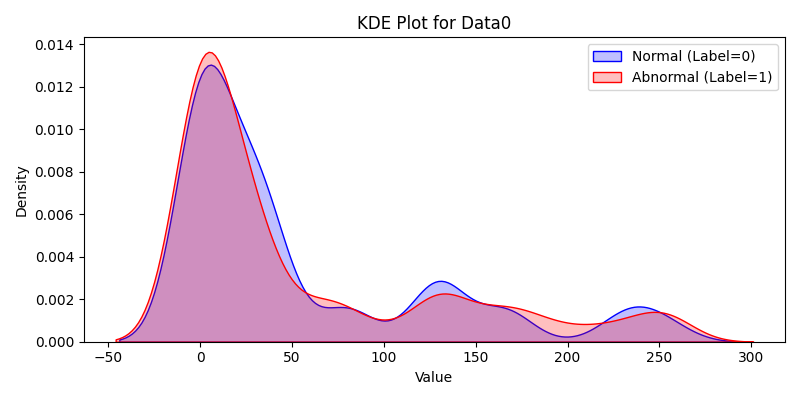
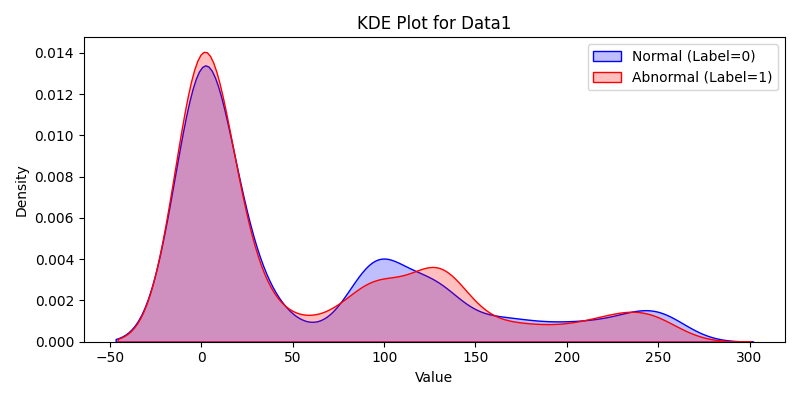
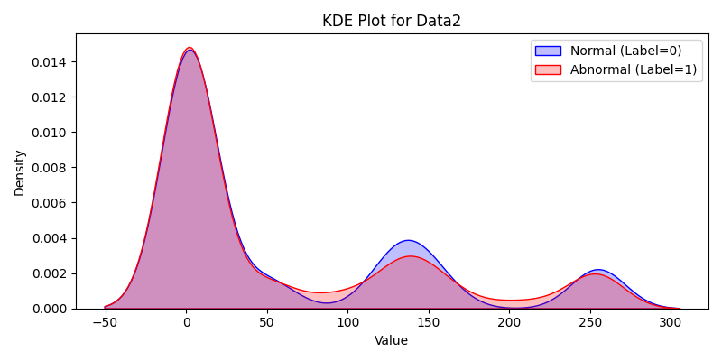
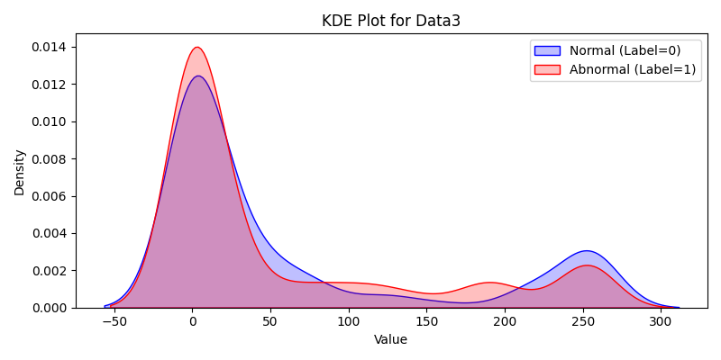
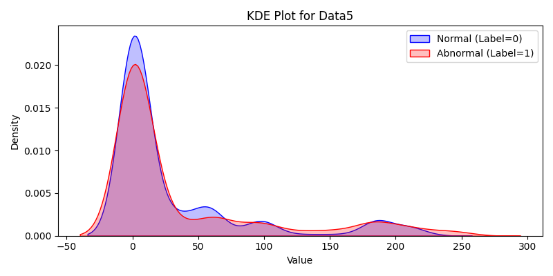
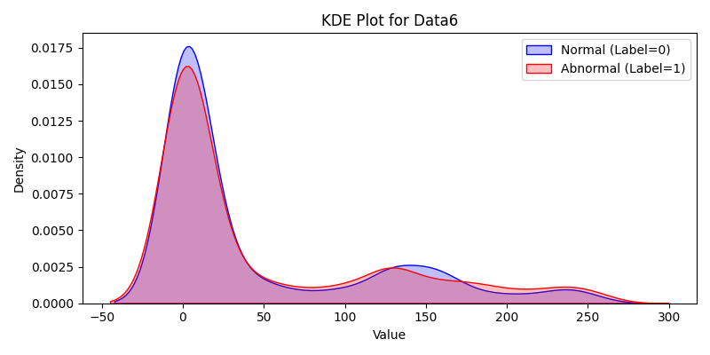
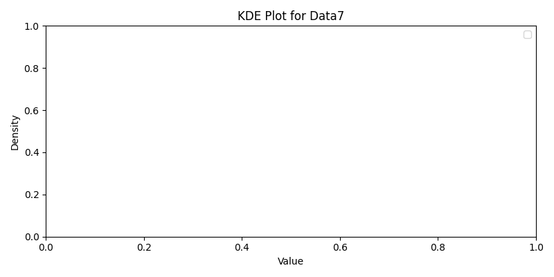

# Trained Model For Car Anamoly Predictions
The dataset was taken from [https://ocslab.hksecurity.net/Datasets](https://ocslab.hksecurity.net/Datasets)

This model is trained upon 3000 normal dataset and 1000 DOS, 1000 Fuzzy, 1000 Impersonation. The attacked data was combined and labeled as 1 and the normal data on the otherside was labeled as 0 for binary classification. 
The dataset contains following features
- Timestamp: Time when the message was sent.
- CAN ID: Unique identifier of the message (who sent it).
- DLC: Data Length Code (how many bytes).
- Data bytes: Actual payload (8 bytes max in standard CAN).
- Label: Label for dataattack or not

## Data Generation
### Data Labeling
To generate the labeled data, combine the data into a file and use the label-placer.py to generated the binary classified data

### Data Cleaning & Converting
The rows with 0 data for all the data bytes was removed because we don't get any positive results using those rows. 
For the remaining rows the data was converted from the hexal bytes to decimal for proper calculations

### Feature Engineering
## 🚗 Feature Engineering for CAN Bus Dataset

The following features were created from the raw CAN data to help train a more efficient and robust machine learning model:

| Feature              | Description                                       | Why It Helps                                                                 |
|----------------------|---------------------------------------------------|------------------------------------------------------------------------------|
| `byte_sum`           | Sum of all data bytes (`Data0` to `Data7`)       | Captures overall payload weight; some attacks might alter the sum significantly. |
| `byte_mean`          | Mean of data bytes                                | Averages out byte values; helps detect small but systemic shifts in data.   |
| `byte_std`           | Standard deviation of data bytes                 | Indicates how dispersed the byte values are; attacks often increase variance. |
| `byte_max`           | Max value in data bytes                           | Detects spikes in individual bytes.                                         |
| `byte_min`           | Min value in data bytes                           | Detects zeroing or nulling attacks.                                        |
| `byte_diff_maxmin`   | Difference between max and min byte               | Measures range; useful in spotting attacks that affect only extremes.       |
| `byte_median`        | Median of data bytes                              | Helps when data has outliers or is skewed.                                  |
| `byte_skew`          | Skewness of byte values                           | Reveals asymmetry; unusual in consistent normal frames.                     |
| `byte_kurtosis`      | Kurtosis of byte values                           | Indicates how heavy the tails of the distribution are (extreme values).     |
| `id_encoded`         | Label-encoded `ID` column                         | Converts categorical CAN IDs into numerical format for model input.         |

> These features aim to highlight statistical and structural behaviors in the CAN frame payloads that may signal abnormal or malicious activity.

## EDA Reporting
Exploratory data analysis was performed that how different attacks are affecting different data bytes. 

### Data 0
Unchanged in attacks: Range is almost the same across all labels.

Low variability: nunique is low (25–31), and mean doesn't change significantly.

🔍 Conclusion: Stable — not actively modified in attacks.

### Data 1
High variability: nunique jumps from 114 (normal) → 207 (fuzzy), 52 (impersonation).

Mean increases in fuzzy (97.7) and slightly decreases in impersonation (73.6).

🔍 Conclusion: Manipulated in fuzzy attacks, likely random or noisy changes. In impersonation, variation is more controlled.

### Data 2
Very stable across all attacks and normal. Only ~20–23 unique values.

🔍 Conclusion: Unchanged, likely not involved in attacks.

### Data 3
Stable with low variation (nunique 21–24). Mean and standard deviation remain close.

🔍 Conclusion: Unchanged, not targeted.

### Data 4
Clear drop in mean from 206 (normal) to ~147 (fuzzy) and 149 (impersonation).

Also, nunique drops from 2 to 1 — only one value used in each attack type.

🔍 Conclusion: Deliberately modified, particularly targeted in attacks.

### Data 5
Drops from mean 210 → 205 in impersonation. Slight change in values.

nunique also drops.

🔍 Conclusion: Subtly modified, possibly to avoid detection.

### Data 6
Wide value range and high nunique in attacks — especially fuzzy.

Slight increase in mean in attacks.

🔍 Conclusion: May be altered in fuzzy, less so in impersonation.

### Data 7
Always 0 in every scenario (min = max = mean = 0, nunique = 1).

🔍 Conclusion: Not changed in any attack.

# Model Training
The model was trained using CNN, RNN, LSTN, ATT_LSTM separately using the-four.py file. And were saved in saved trained_models folder

Model was also trained on rj48 using rj48.py file. It was saved in trained_model named rj48.pkl

# Model Testing
Model was tested for some records using testing_data_converted.csv on the trained model and the predictions were made.

